Minimal setup to observe the Grokking phenomenon on an algorithmic task.

## Description
This is a minimal setup to observe Grokking (delayed generalization) on an algorithmic task.

The task is **modular addition**: given two integers `a` and `b`, predict `(a + b) mod P`, framed as classification over `P` classes. `P` is a constant near the top of `train.py` (currently `3`). Each integer is mapped to a learnable embedding of dimension `hidden_dim` (default `128`); the two embeddings are combined and fed through a small network with a `P`-way readout, trained with cross-entropy. 60% of the `P²` possible `(a, b)` pairs are used for training and the rest for validation, so the model has to *generalize* the addition rule to held-out pairs.

Beyond the standard gradient-based setup, the same model can be optimized with several gradient-free optimizers, letting you compare how different search strategies reach (or fail to reach) the grokking solution.

## Run
Run `python train.py --grok` to see the grokking training curves:


and `python train.py` for a more "normal" (comprehension) run:


> **Note:** the graphs above were generated with `P = 3`, `--arch fft`, and `--hidden-dim 4` — a tiny model with only **27 parameters**.

The only difference between these two runs is the weight decay: it is low (`6e-5`) in the grokking run and high (`1`) in the non-grokking (comprehension) run, toggled by `--grok`. For more details on the effect of hyperparameters on the grokking phenomenon, see [this paper: Towards understanding grokking](https://arxiv.org/abs/2205.10343).

The `--log` option logs training curves and a model checkpoint to `log/<run_name>/`. Running `python plot.py` then reads everything under `log/` and writes an `images/metrics/P<P>/metrics_<run_name>.jpg` plot for each run — Loss, weight statistics, and (when the run was trained with `--track-optimum`) the optimum-distance curves. e.g. the images above. Pass `python plot.py --anim` to additionally render an `images/emb/P<P>/emb_<run_name>.mp4` animation of the embeddings via PCA (requires `scikit-learn`).

Generated images are organized into `images/<category>/P<P>/` by analysis type (`metrics`, `lon`, `ela`, `ela_traj`, `emb`) and the run's modulus `P`; cross-`P` sweep plots go in `images/sweeps/`.

## Algorithms
Select the optimizer with `--algo` (default `gradient`):

| `--algo`   | Optimizer | Notes |
|------------|-----------|-------|
| `gradient` | AdamW (gradient descent) | Weight decay set by `--grok`. Supports low-rank reparametrization via `--rank`. |
| `cmaes`    | LM-CMA-ES (evolution strategy) | Optional low-rank search via `--rank`. |
| `cpso`     | Cooperative PSO (particle swarm) | `--cognition`, `--society`. |
| `de`       | TDE (trigonometric differential evolution) | `--f`, `--cr`, `--tm`. |
| `g3pcx`    | G3PCX (real-coded genetic algorithm) | `--n-offsprings`, `--n-parents`. |
| `moea`     | NSGA-II (bi-objective) | Minimizes train loss and weight norm jointly, then picks a point on the Pareto front using the `--grok` trade-off. |

The gradient-free optimizers minimize a single regularized objective — `train_loss + weight_decay · mean(weights²)` — so `--grok` controls their regularization strength just as it controls AdamW's weight decay.

## Results
Metric curves for each optimizer under both regimes (all generated with `P = 3`, `--arch fft`, `--hidden-dim 4` — 27 parameters):

| Optimizer | Grokking (`--grok`)                                       | Comprehension                                                  |
|-----------|-----------------------------------------------------------|----------------------------------------------------------------|
| `gradient` | 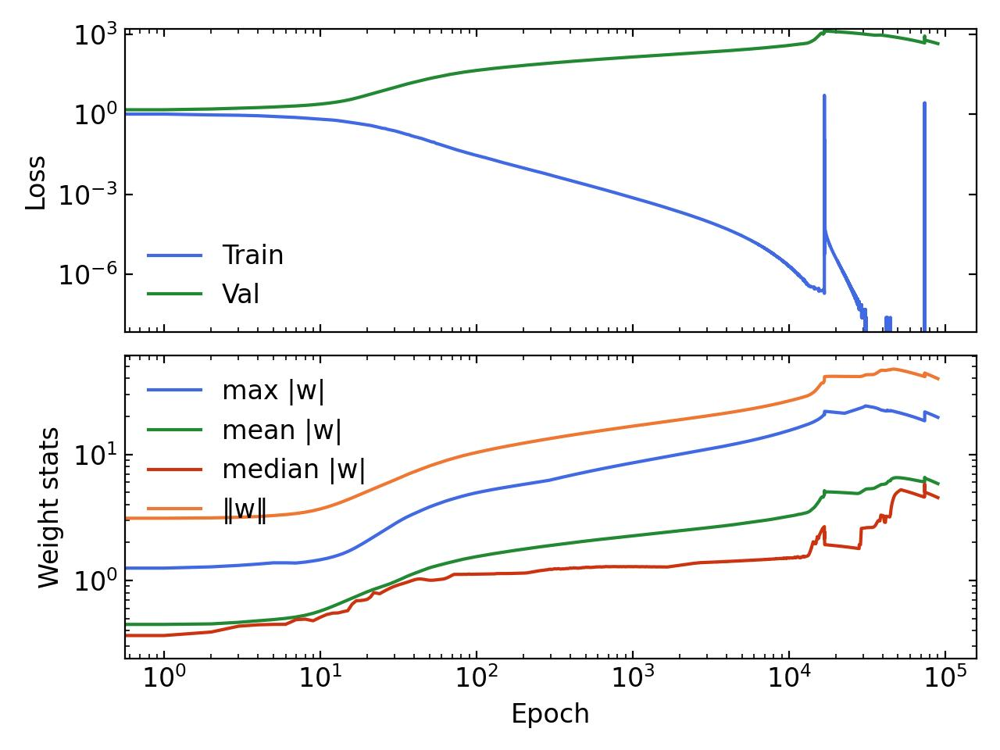 | 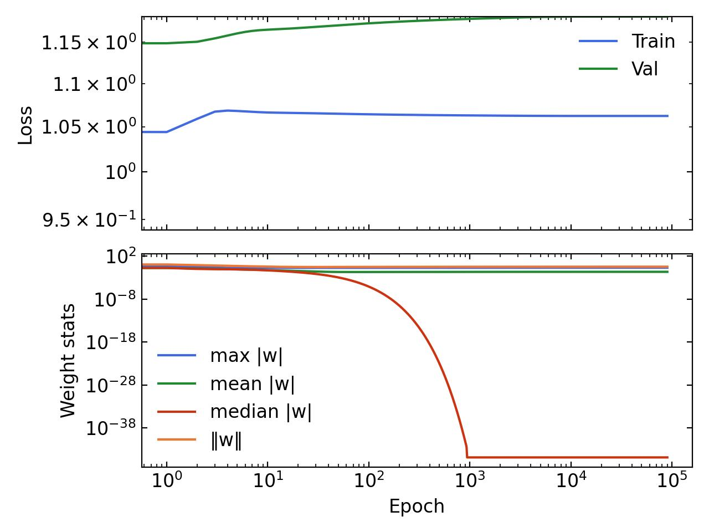 |
| `cmaes`    | 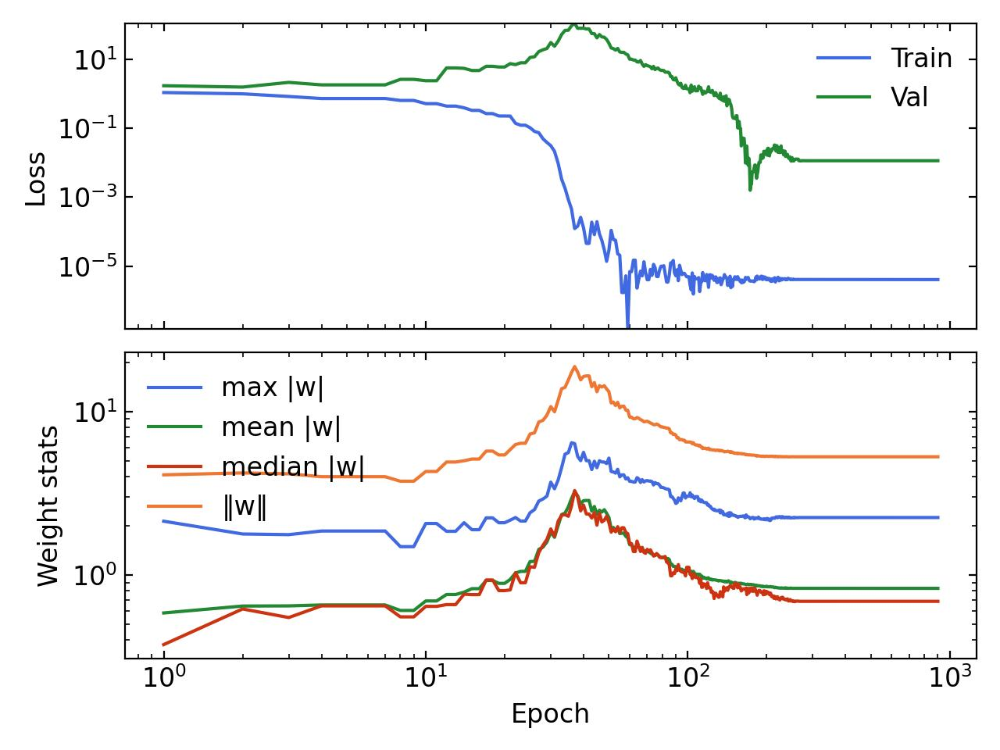       | 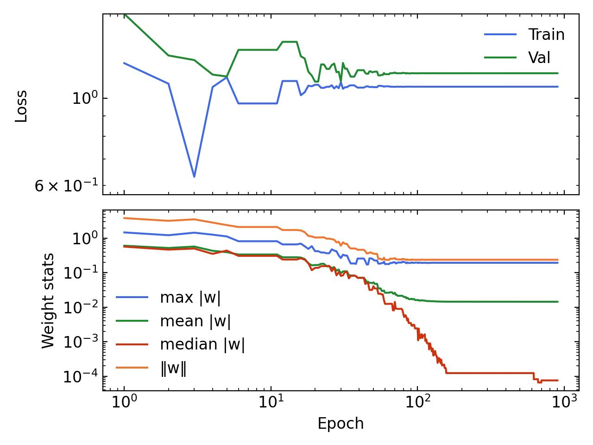    |
| `cpso`     | 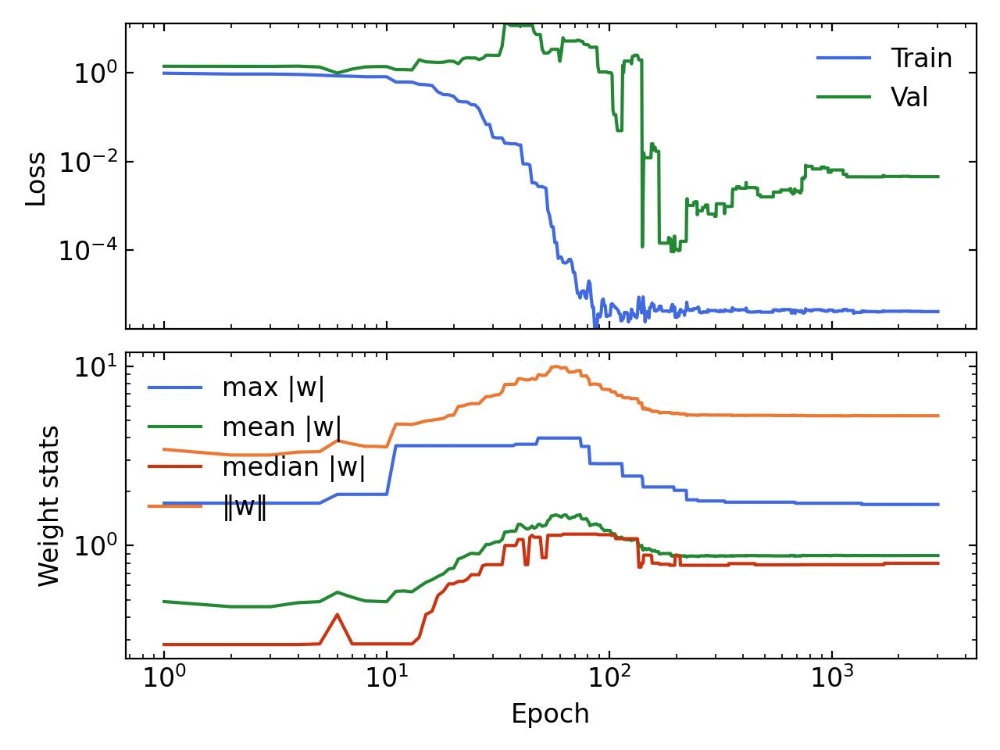        | 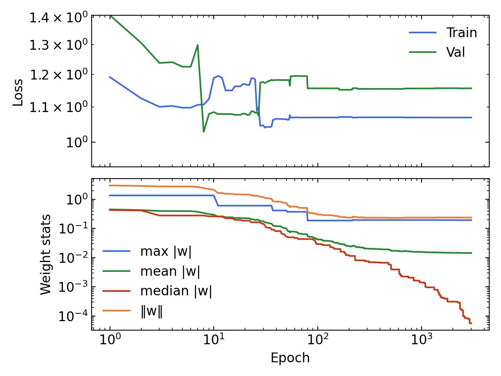     |
| `de`       | 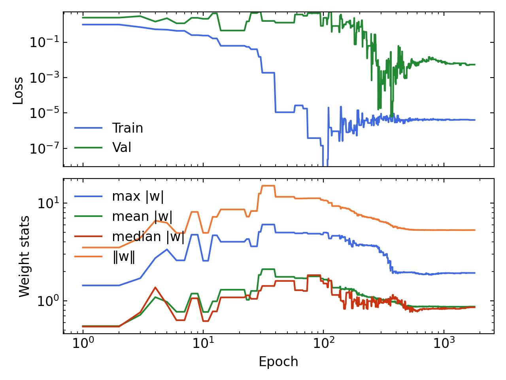          | 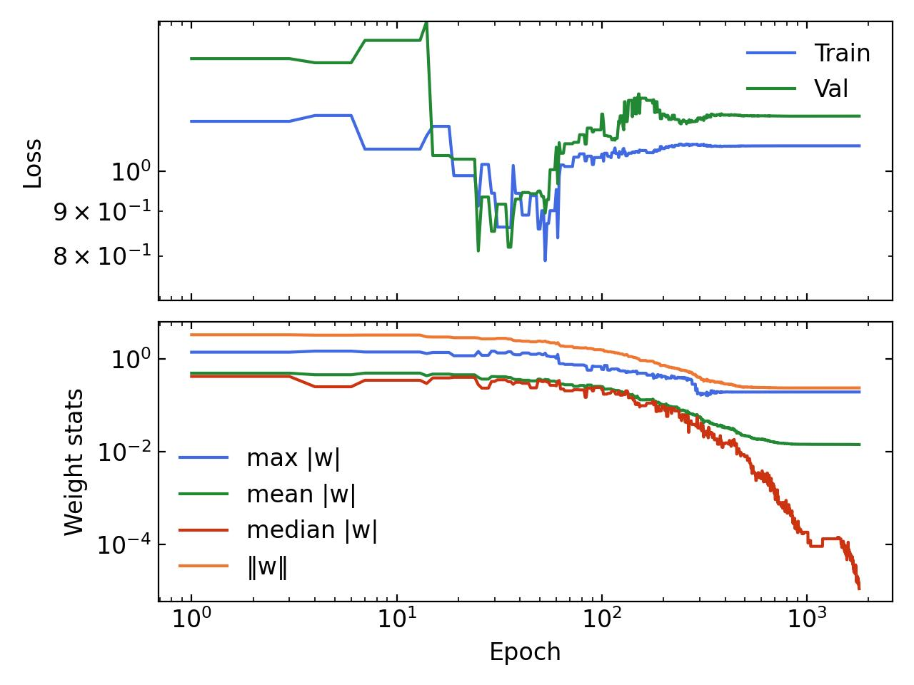       |
| `g3pcx`    | 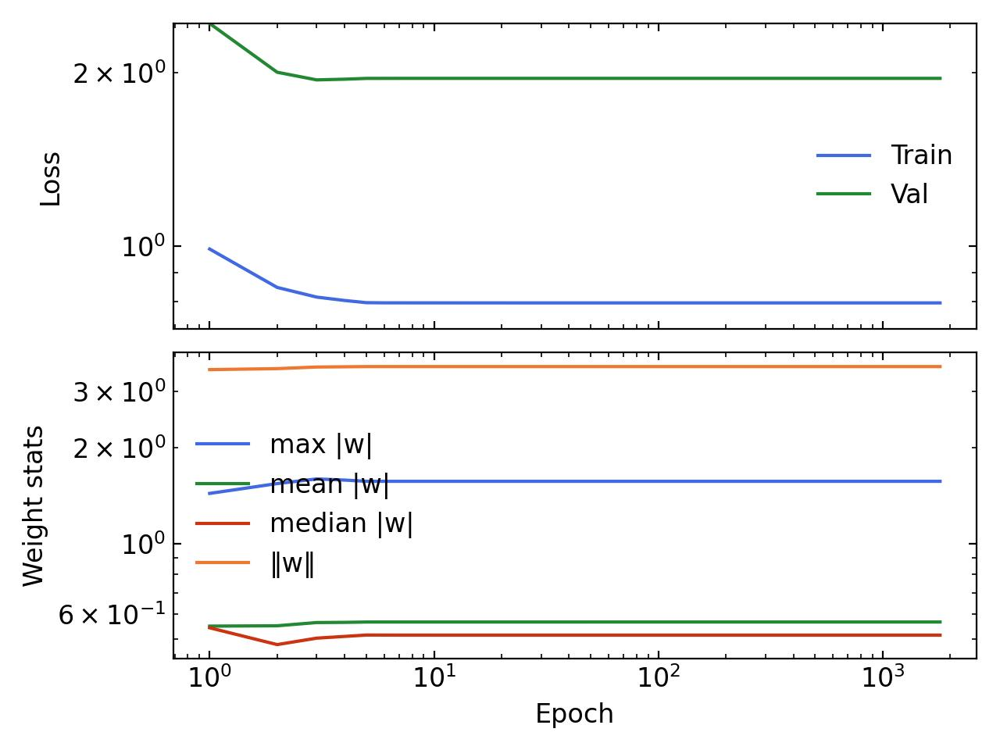       | 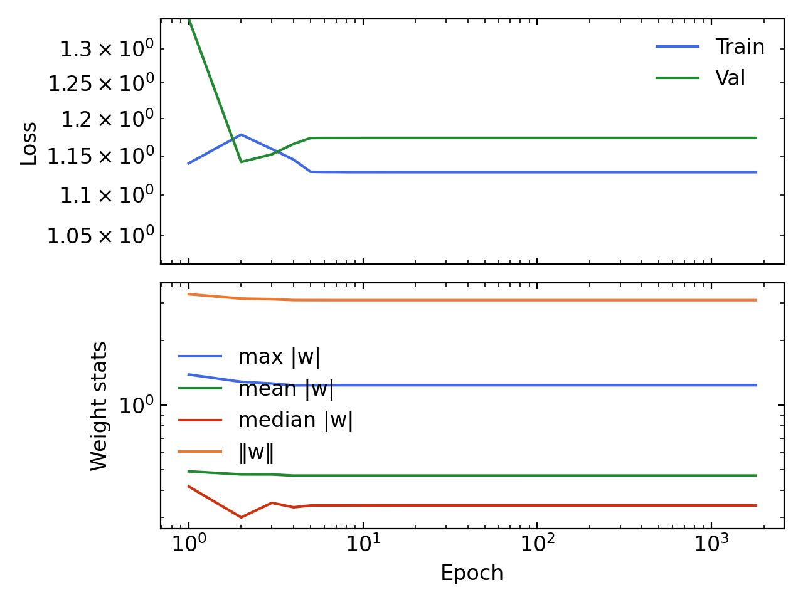    |
| `moea`     | 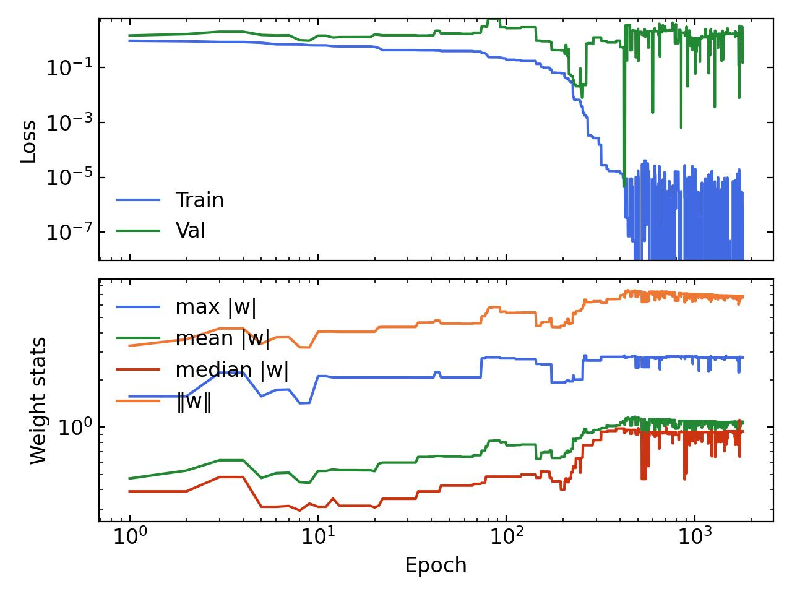        | 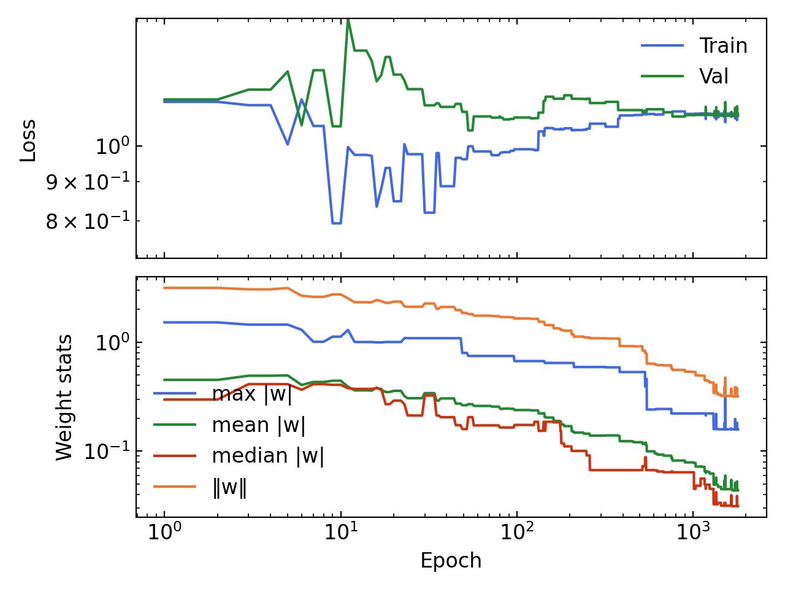     |

## Fitness landscape (LON)
Instead of training, you can analyze the *structure* of the optimized problem with a **Local Optima Network (LON)** via [lonkit](https://github.com/helix-agh/lonkit). Pass `--lon`:

```bash
python train.py --lon --arch fft --hidden-dim 4 --grok
```

This maps the same regularized objective the evolutionary optimizers minimize — `train_loss(weights) + weight_decay · mean(weights²)` — over the model's parameter space (bounded by `±--bound-norm`). lonkit runs basin-hopping to find local optima, connects them into a network, and reports landscape metrics such as `n_optima`, `n_funnels`, `n_global_funnels`, `global_strength`, and `success`. It writes three files to `images/lon/P<P>/`:

- `lon_<arch>_P<P>_<regime>.png` — 2D LON plot (nodes are optima colored by fitness, the global optimum in red; edges are basin-hopping transitions),
- `lon3d_<arch>_P<P>_<regime>.html` — interactive 3D view,
- `lon_<arch>_P<P>_<regime>.json` — the metrics.

LON construction scales poorly with dimension, so use a tiny model (`--arch fft --hidden-dim 4` is 27 parameters); a warning is printed for larger ones. `--grok` selects which weight-decay regime's landscape is analyzed.

## Fitness landscape (ELA)
`--ela` measures **Exploratory Landscape Analysis** features of the same regularized objective — a numerical fingerprint of the landscape complementary to the LON:

```bash
python train.py --ela --arch fft --hidden-dim 4 --grok
```

It draws a Latin-hypercube sample over the parameter space (`±--bound-norm`, `--ela-samples` points, default `max(50·ndim, 200)`), evaluates the objective, and computes the classical ELA feature groups, written to `images/ela/P<P>/ela_<arch>_P<P>_<regime>.json`:

- **`ela_meta`** — fit quality (adjusted R²) and coefficients of linear / quadratic surrogate models,
- **`ela_distr`** — skewness, excess kurtosis, and number of peaks of the objective-value distribution,
- **`disp`** — dispersion of the best quantiles vs. the whole sample (global structure),
- **`nbc`** — nearest-better-clustering ratios and the distance/fitness correlation,
- **`ic`** — information content (`h_max`, settling sensitivity, partial information) over a nearest-neighbour walk.

This is a self-contained numpy/scipy reimplementation of the standard feature sets (Mersmann et al. 2011; Lunacek & Whitley 2006; Kerschke et al. 2015; Muñoz et al. 2015). It does **not** use `pflacco`, which pins `numpy~=1.24` and cannot coexist with this project's numpy 2.x / torch stack — so values follow the literature definitions but may differ from pflacco at the margins.

### Trajectory ELA (`--ela-trajectory`)
By default `--ela` samples the whole search box (Latin hypercube) — the *global* landscape. With `--ela-trajectory` the features are instead computed from the points the optimizer **actually evaluates** while running (online / trajectory-based ELA), characterizing the region CMA-ES traverses:

```bash
python train.py --ela-trajectory --algo cmaes --arch fft --hidden-dim 4 --grok --P 3
```

This runs the optimizer normally, records every evaluated `(x, fitness)`, subsamples to `--ela-samples` points (default 2000, to bound the O(n²) feature math), and writes `images/ela_traj/P<P>/ela_traj_<arch>_P<P>_<regime>.json`. It requires a population-based `--algo` (`cmaes`/`cpso`/`de`/`g3pcx`); the trajectory typically looks far smoother (e.g. higher linear `adj_r2`) than the global LHS sample because it concentrates in the convergence basin.

### Sweeping P
`ela_sweep.sh` logs ELA features (for the CMA-ES problem) across several moduli `P`, in both regimes. It takes a mode argument — `lhs` (default, global box) or `trajectory` (CMA-ES path) — and writes one `images/<prefix>/P<P>/<prefix>_<arch>_P<P>_<regime>.json` per run (`prefix` = `ela` or `ela_traj`). Then `plot_ela_sweep.py` aggregates those files and plots every feature as a function of `P`, overlaying grokking vs. comprehension:

```bash
bash ela_sweep.sh                   # LHS sweep over P in {2,3,5,7,11,13}
python plot_ela_sweep.py            # -> images/sweeps/ela_sweep_fft.png

bash ela_sweep.sh trajectory        # CMA-ES trajectory sweep
python plot_ela_sweep.py ela_traj   # -> images/sweeps/ela_traj_sweep_fft.png
```

Edit `P_VALUES`, `ARCH`, `HIDDEN_DIM`, `ELA_SAMPLES`, and `EPOCHS` at the top of `ela_sweep.sh` to change the sweep (the sample size is held fixed across `P` so features stay comparable).

## Comparing optima (`--track-optimum`)
A neural network's weight space has **symmetries** — different weight vectors that compute the identical function — so raw Euclidean distance between two optima is misleading (a relabeled copy looks far away). The symmetries here are: permutation of hidden units / embedding features (`mlp`, `cnn`), continuous rescaling / linear reparametrization of the embedding space, and the cyclic structure of the `fft` model. The output classes are the actual sums, so the *function* is canonical.

Store an optimum (the per-layer parameter dump printed after training, saved as JSON `{layer: values}`), then track how close a new run gets to it:

```bash
python train.py --algo cmaes --arch fft --hidden-dim 4 --grok --track-optimum optimum.json
```

Two symmetry-aware distances are reported (in the progress bar as `fΔ`/`wΔ`, logged to `metrics.jsonl` when `--log`, and printed at the end):

- **functional** (`func_prob_rmse`, `func_disagreement`) — compares what the networks *compute* over all `P²` inputs (RMSE of softmax probabilities + argmax-disagreement rate). Invariant to **all** the symmetries above; `0` ⟺ same function. This is the complete "are these the same optimum?" measure.
- **permutation-aligned weight distance** (`weight_dist_aligned`, vs raw `weight_dist_raw`) — Git Re-Basin style: Hungarian-matches neurons between the two nets, applies the permutation, then takes Euclidean distance. Useful for landscape geometry, but only removes *permutations* — for `mlp`/`cnn` it is ≤ the raw distance; for `fft` (no neuron-permutation symmetry) it **equals** the raw distance, so rely on the functional distance there.

The stored optimum must come from the same `--arch`/`--hidden-dim`/`P` (validated on load).

## Options
Common:
- `--algo {gradient,cmaes,cpso,de,g3pcx,moea}` — optimizer (default `gradient`).
- `--arch {mlp,cnn,fft}` — model architecture (default `mlp`).
- `--grok` — grokking mode: low weight decay (`6e-5`) instead of the comprehension default (`1`).
- `--hidden-dim N` — embedding / hidden dimension (default `128`).
- `--epochs N` — training epochs / generations (default `10000`).
- `--log` — enable metric logging and model checkpointing.
- `--track-optimum PATH` — track functional + permutation-aligned weight distance of the current-best solution to a stored optimum JSON (see [Comparing optima](#comparing-optima---track-optimum)).
- `--lon` / `--ela` — analyze the fitness landscape (LON / ELA features) instead of training; `--ela-samples N` sets the ELA sample size.

Gradient (`--algo gradient`):
- `--lr` — AdamW learning rate (default `8e-2`).
- `--rank R` — low-rank reparametrization (`0` = disabled; `>0` optimizes `U @ Vᵀ` of the given rank).

Evolutionary (`cmaes` / `cpso` / `de` / `g3pcx`):
- `--bound-norm` — search-space boundary `±bound-norm` (default `5.0`).
- `--n-individuals` — population size (default: auto from problem dimension).
- `--sigma` — initial step size / population spread (default `0.5`).
- `--seed` — optimizer RNG seed (default `2`).

Optimizer-specific:
- `cmaes`: `--rank` (low-rank search, as above).
- `cpso`: `--cognition` (default `1.49`), `--society` (default `1.49`).
- `de`: `--f` (default `0.99`), `--cr` (default `0.85`), `--tm` (default `0.05`).
- `g3pcx`: `--n-offsprings` (default `2`), `--n-parents` (default `3`).

Fitness landscape (`--lon`):
- `--lon` — analyze the landscape with a LON instead of training.
- `--lon-runs` — independent basin-hopping runs (default `100`).
- `--lon-no-change` — basin-hopping iterations without improvement before stopping (default `250`).
- `--lon-step-size` — basin-hopping perturbation step size (default `0.1`).
- `--bound-norm` / `--seed` — reused for the search-space bounds and RNG seed.

## Requirements
Install the project dependencies (`torch`, `numpy`, `tqdm`, `pypop7`, `pymoo`, `lonkit`) — e.g. `pip install -e .` or `uv sync`. Plotting additionally uses `matplotlib`, and the `--anim` option for `plot.py` needs `scikit-learn`.