Minimal setup to observe the Grokking phenomenon on an algorithmic task.

## Description
This is a minimal setup to observe Grokking (delayed generalization) on an algorithmic task.

The task is **modular addition**: given two integers `a` and `b`, predict `(a + b) mod P`, framed as classification over `P` classes. `P` is a constant near the top of `train.py` (currently `3`). Each integer is mapped to a learnable embedding of dimension `hidden_dim` (default `128`); the two embeddings are combined and fed through a small network with a `P`-way readout, trained with cross-entropy. 60% of the `P²` possible `(a, b)` pairs are used for training and the rest for validation, so the model has to *generalize* the addition rule to held-out pairs.

Beyond the standard gradient-based setup, the same model can be optimized with several gradient-free optimizers, letting you compare how different search strategies reach (or fail to reach) the grokking solution.

## Run
Run `python train.py --grok` to see the grokking training curves:

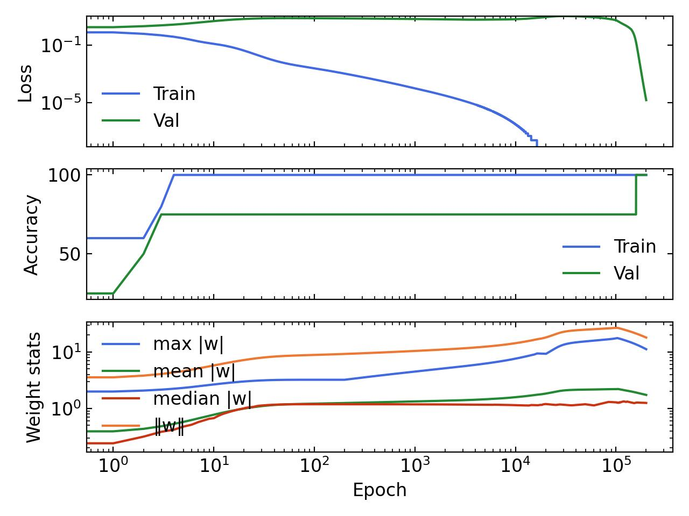

and `python train.py` for a more "normal" (comprehension) run:

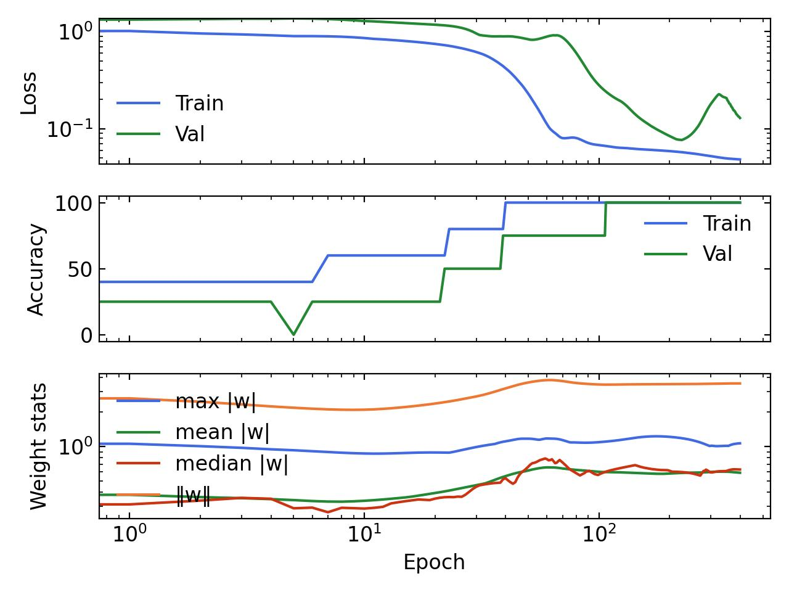

> **Note:** the graphs above were generated with `P = 3`, `--arch fft`, and `--hidden-dim 4` — a tiny model with only **27 parameters**.

The only difference between these two runs is the weight decay: it is low (`6e-5`) in the grokking run and high (`1`) in the non-grokking (comprehension) run, toggled by `--grok`. For more details on the effect of hyperparameters on the grokking phenomenon, see [this paper: Towards understanding grokking](https://arxiv.org/abs/2205.10343).

The `--log` option logs training curves and a model checkpoint to `log/<run_name>/`. Running `python plot.py` then reads everything under `log/` and writes an `images/metrics_<run_name>.jpg` plot (Loss / Accuracy / weight statistics) for each run — e.g. the images above. Pass `python plot.py --anim` to additionally render an `images/emb_<run_name>.mp4` animation of the embeddings via PCA (requires `scikit-learn`).

## Algorithms
Select the optimizer with `--algo` (default `gradient`):

| `--algo`   | Optimizer | Notes |
|------------|-----------|-------|
| `gradient` | AdamW (gradient descent) | Weight decay set by `--grok`. Supports low-rank reparametrization via `--rank`. |
| `cmaes`    | LM-CMA-ES (evolution strategy) | Optional low-rank search via `--rank`. |
| `cpso`     | Cooperative PSO (particle swarm) | `--cognition`, `--society`. |
| `de`       | TDE (trigonometric differential evolution) | `--f`, `--cr`, `--tm`. |
| `g3pcx`    | G3PCX (real-coded genetic algorithm) | `--n-offsprings`, `--n-parents`. |
| `moea`     | NSGA-II (bi-objective) | Minimizes train loss and weight norm jointly, then picks a point on the Pareto front using the `--grok` trade-off. |

The gradient-free optimizers minimize a single regularized objective — `train_loss + weight_decay · mean(weights²)` — so `--grok` controls their regularization strength just as it controls AdamW's weight decay.

## Results
Metric curves for each optimizer under both regimes (all generated with `P = 3`, `--arch fft`, `--hidden-dim 4` — 27 parameters):

| Optimizer | Grokking (`--grok`) | Comprehension |
|-----------|---------------------|---------------|
| `gradient` |  |  |
| `cmaes`    | 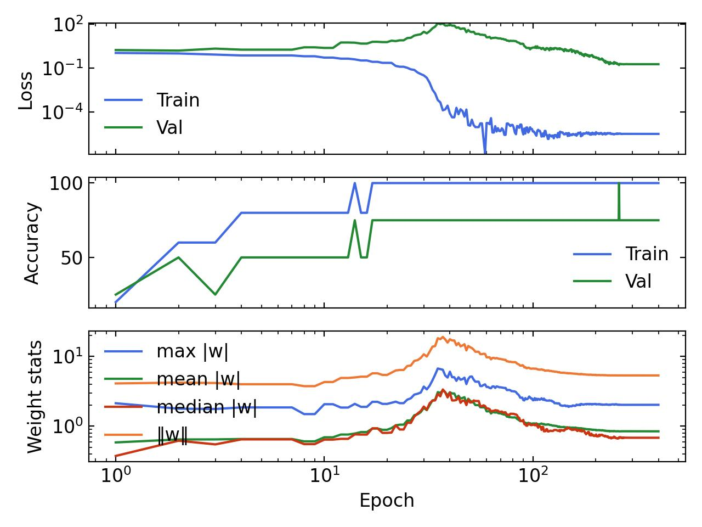    | 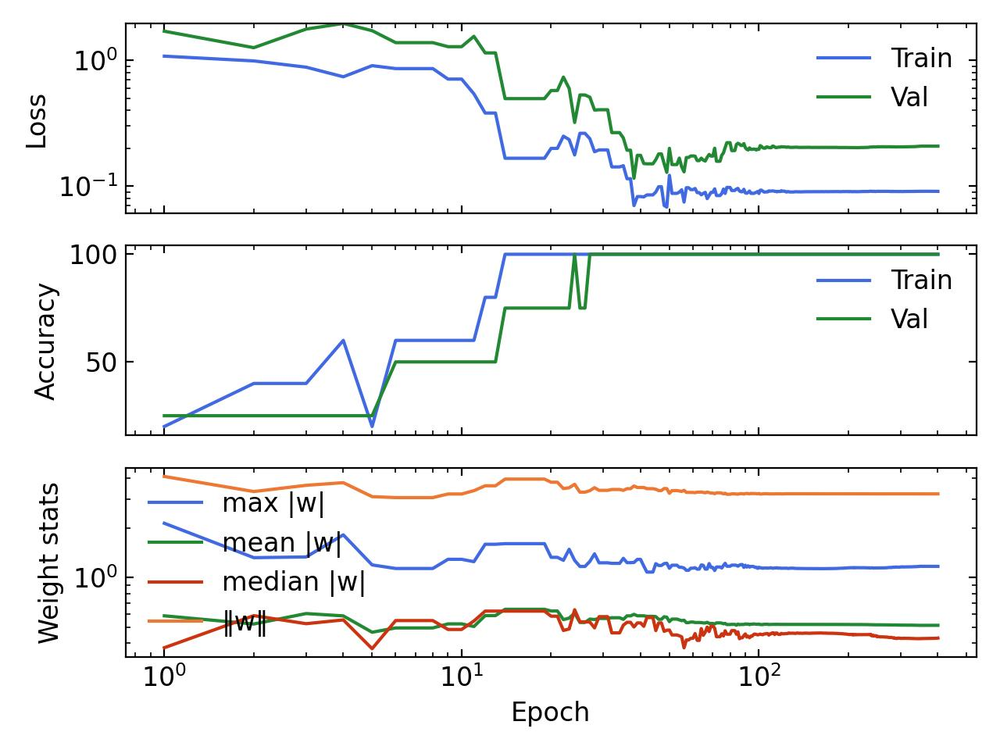 |
| `cpso`     | 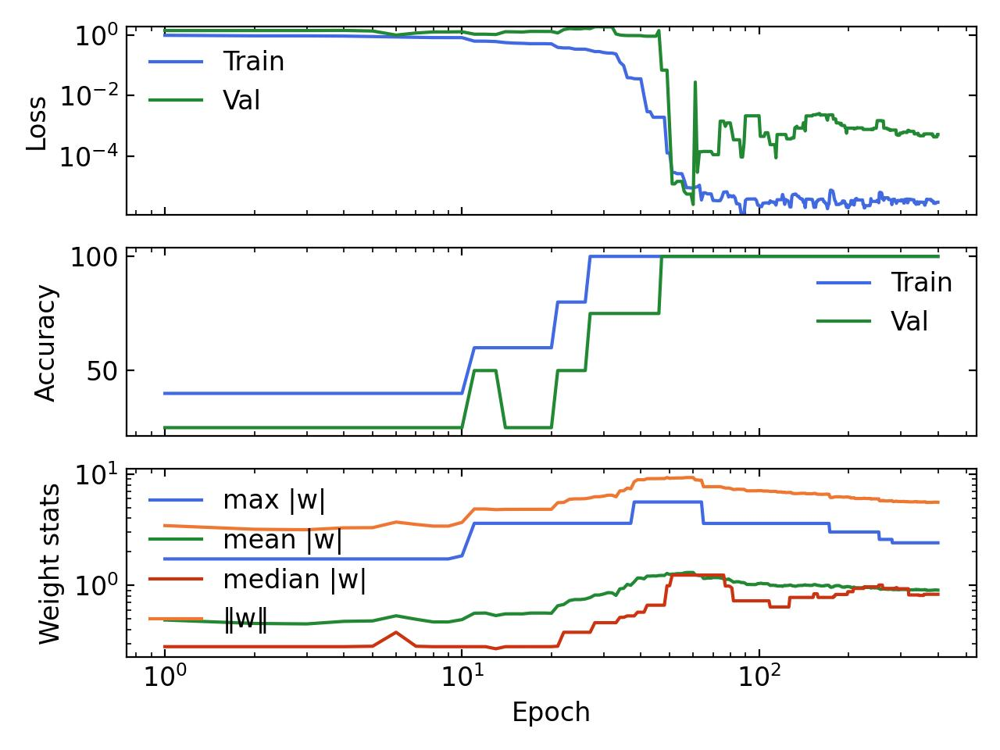     | 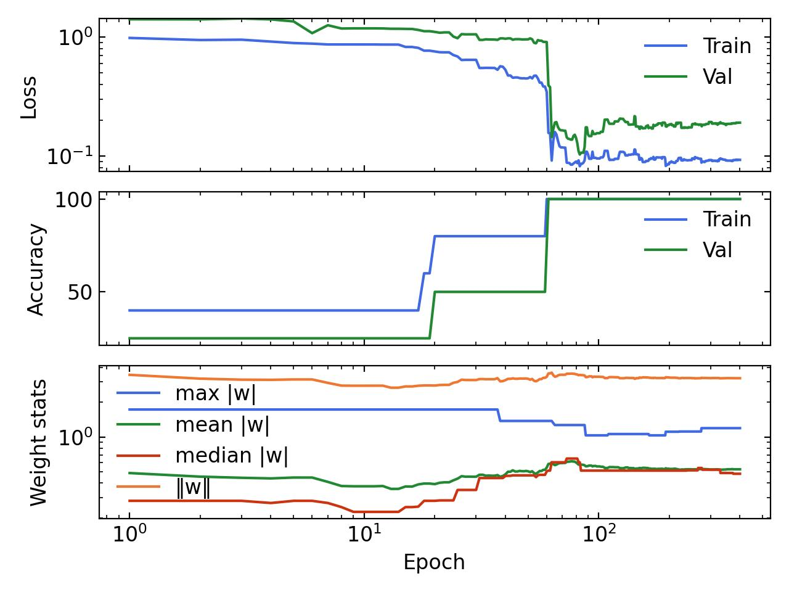 |
| `de`       | 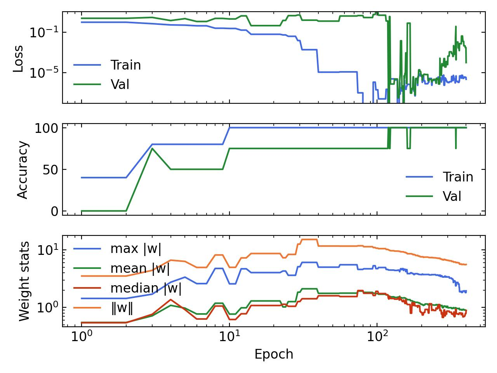       | 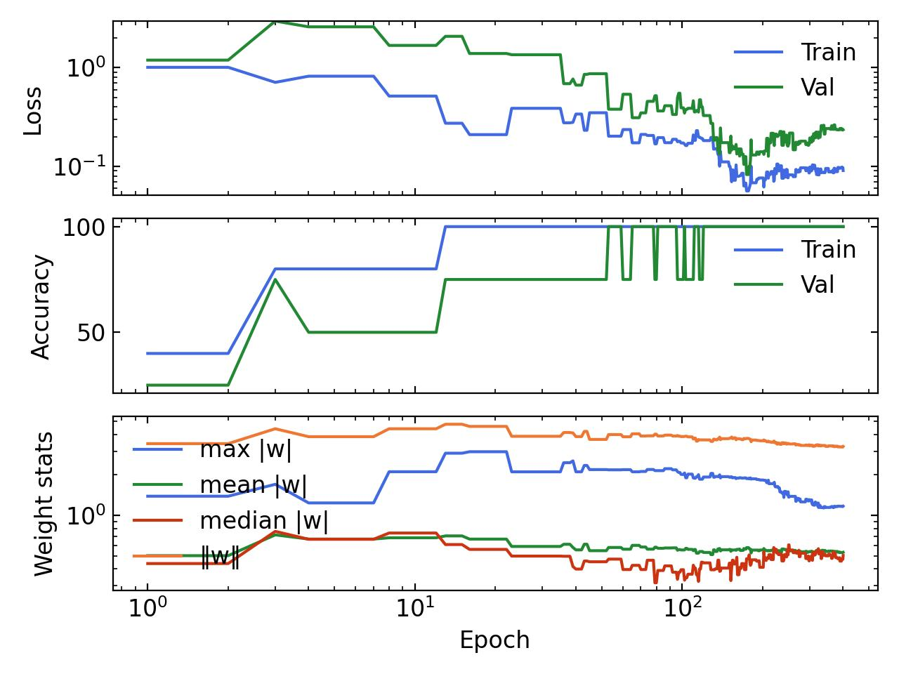 |
| `g3pcx`    | 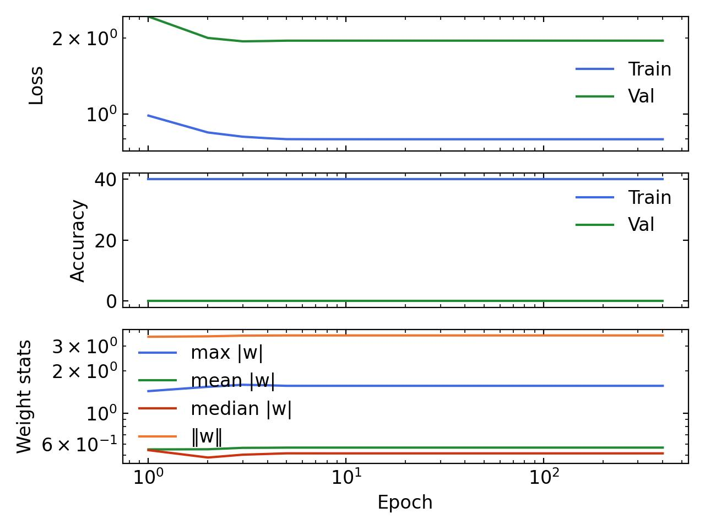    | _(not generated)_ |
| `moea`     | 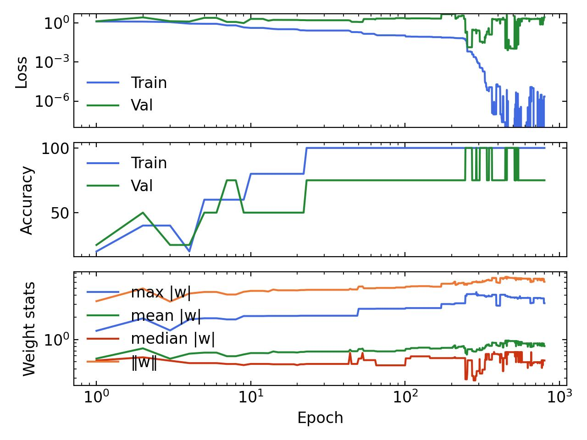     | 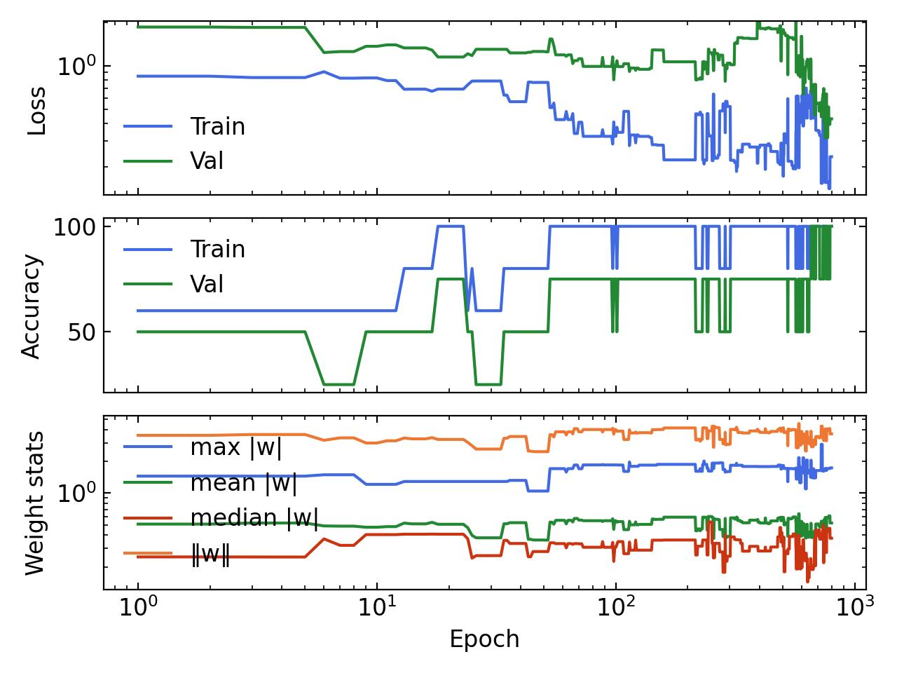 |

## Options
Common:
- `--algo {gradient,cmaes,cpso,de,g3pcx,moea}` — optimizer (default `gradient`).
- `--arch {mlp,cnn,fft}` — model architecture (default `mlp`).
- `--grok` — grokking mode: low weight decay (`6e-5`) instead of the comprehension default (`1`).
- `--hidden-dim N` — embedding / hidden dimension (default `128`).
- `--epochs N` — training epochs / generations (default `10000`).
- `--log` — enable metric logging and model checkpointing.

Gradient (`--algo gradient`):
- `--lr` — AdamW learning rate (default `8e-2`).
- `--rank R` — low-rank reparametrization (`0` = disabled; `>0` optimizes `U @ Vᵀ` of the given rank).

Evolutionary (`cmaes` / `cpso` / `de` / `g3pcx`):
- `--bound-norm` — search-space boundary `±bound-norm` (default `5.0`).
- `--n-individuals` — population size (default: auto from problem dimension).
- `--sigma` — initial step size / population spread (default `0.5`).
- `--seed` — optimizer RNG seed (default `2`).

Optimizer-specific:
- `cmaes`: `--rank` (low-rank search, as above).
- `cpso`: `--cognition` (default `1.49`), `--society` (default `1.49`).
- `de`: `--f` (default `0.99`), `--cr` (default `0.85`), `--tm` (default `0.05`).
- `g3pcx`: `--n-offsprings` (default `2`), `--n-parents` (default `3`).

## Requirements
Install the project dependencies (`torch`, `numpy`, `tqdm`, `pypop7`, `pymoo`) — e.g. `pip install -e .` or `uv sync`. Plotting additionally uses `matplotlib`, and the `--anim` option for `plot.py` needs `scikit-learn`.